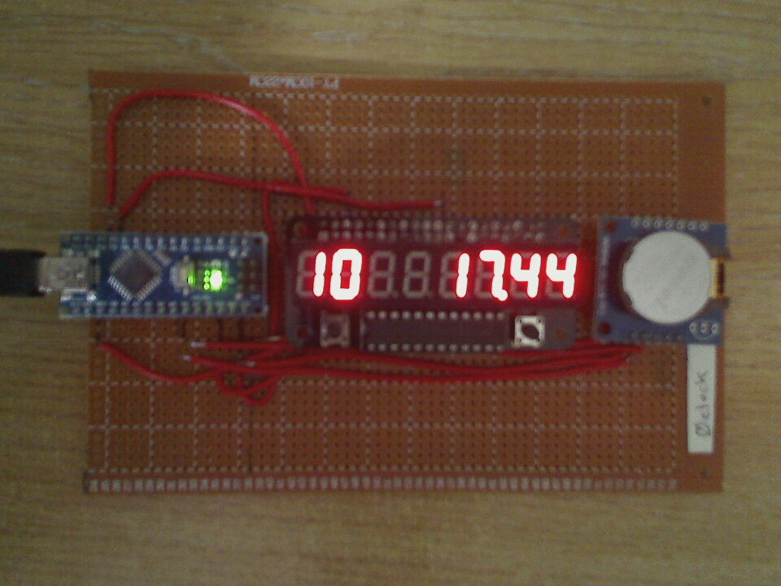

# 0clock

Clock using Nano, 0seg (zerosegment display) and Tiny RTC.

Use tdiff.pl6 for fine-tune nudge offsets.

Install "RTClib by Adafruit".

Picture:

Wiring is as per db05.105 (includes RTC, which is down the bottom)
