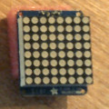

# 8x8

Adafruit LED 8x8 green matrix with I2C pack using HT16K33 controller



```
git clone https://github.com/adafruit/Adafruit_LED_Backpack
git clone https://github.com/adafruit/Adafruit-GFX-Library
```

Connection:
```
     8x8    Uno
+      +     5V
-      -    GND
SDA    D     A4
SCL    C     A5
```

## See also

* [I2C with ATTiny85 on Adafruit Trinket](https://mythopoeic.org/adafruit-trinket-i2c/)

