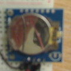

# rpi
My Arduino, ATTiny85 and RPi (Raspberry Pi) projects

Reference information:


* [GPIO-pi3](GPIO-pi3.md): pin diagram for RPi3.
* [i2c](i2c/README.md): Arduino and RPi3 master, ATTiny85 slave

## Arduino Nano/Uno

* [0clock](0clock/README.md): clock made with nano, 0seg, and tiny RTC.
* [abaclock](abaclock/README.md): clock made with a RTC clock and an Arduino LED backpack
* [IDE](Arduino-IDE.md) : general setup, particularly about ATTiny85 setup.
* [Multithreading](https://create.arduino.cc/projecthub/reanimationxp/how-to-multithread-an-arduino-protothreading-tutorial-dd2c37)
* sketch_feb05a : RTC clock + zeroseg (0seg) to create a digital clock

## ATTiny85

Necessary, but not sufficient:
```sudo apt install avr-libc```

Technical:
* [pins85](pins85.md):pinout diagram for ATTiny85


## General

* [debounce](https://gist.github.com/blippy/430cc73cb50b9e44c3423c2717ab22ee) a button

## Projects

* blinky85: directory containing code for blinking an ATTiny85 from RPi - consider it a baseline for making projects using C++, and not the IDE
* [clock85](clock85.md): setting the clock
* [dev01](dev01/README.md): projects for the DEV01 home-made board: om
* [dev02](dev02/README.md): projects for the DEV02 home-made board: green_red and mhz85
* ~~[dev04](dev04/README.md): Programming an ATTiny85 from the Pi~~
* [dev05](dev05/README.md): ATTiny85 programmer for the Pi
* [dev06](8x8/dev06): 8x8, nano
* [minitone85](minitone/README.md): working version of tone() for ATtiny85
* [mins30-85](mins30-85/README.md): 30 minute timer for ATTiny85, programmable from the Pi (`DEV01`). 
* [pills](pills/README.md): remember to take your pills
* [synth](synth/README.md): sound synthesizer/tone-maker
* [sleep85](sleep85/README.md): conserving power by putting the ATTiny85 to sleep

### blinkt

Playing around with [blinkt](blinkt/README.md).

### edikit1

Projects that come to mind with the CamJam EduKit 1, including
a self-destruct sequence [here](edukit1/README.md).


## Hardware

* [Enclosures](https://www.banggood.com/10pcs-75-x-54-x-27mm-DIY-Plastic-Project-Housing-Electronic-Junction-Case-Power-Supply-Box-p-1168741.html?cur_warehouse=CN) 10pcs 75 x 54 x 27mm DIY Plastic Project Housing Electronic Junction Case Power Supply Box 
* [Mini USB nano](https://www.ebay.co.uk/sch/i.html?_from=R40&_trksid=m570.l1313&_nkw=mini+usb+nano&_sacat=0). Amazon also has good deals on these
* [ZeroSeg](zeroseg/README.md)

___

 [4](4)

___

 [8x8](8x8)

---

 [rtc](rtc)
