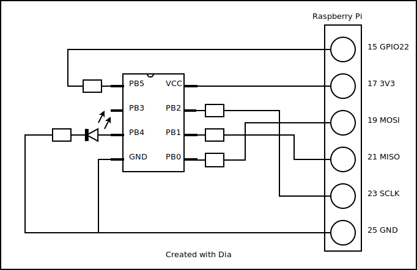
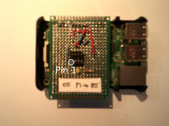

# dev05

Programming an ATTiny85 from the Pi.

Include files are in <code>/usr/lib/avr/include</code>, which I ascertained by typing <code>dpkg-query -L avr-libs</code>

## The board

### Testing

Use project blinky85 for test purposes.

## References

* [instructable](http://www.instructables.com/id/Programming-the-ATtiny85-from-Raspberry-Pi/) 
