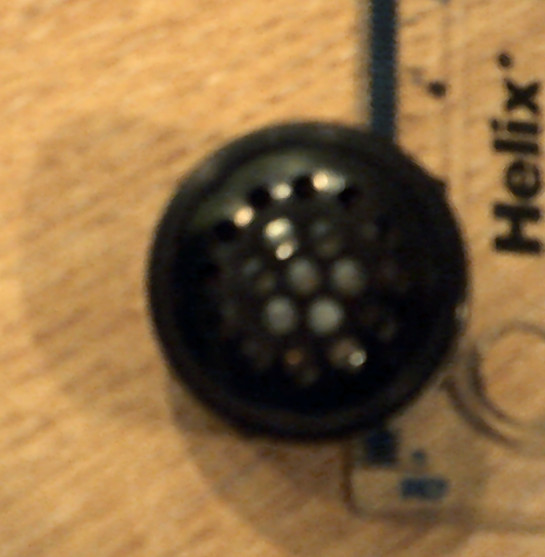

# minitone85

Similar to tone() for the Uno. Limitations: you need to use PB1 for speaker output.

Speaker is as follow:

## References

* DB05/87 for notes
* [Generating sine wave sound in Python](https://stackoverflow.com/questions/8299303/generating-sine-wave-sound-in-python)
* [Online tone generator](http://www.szynalski.com/tone-generator/)
* [Simples Tones for ATtiny](http://www.technoblogy.com/show?KVO)
* [Slightly glitchy sound producint tones via GPIO pins](https://www.raspberrypi.org/forums/viewtopic.php?f=38&t=229711)
* [Using timers to generate 38KHz](http://www.ernstc.dk/arduino/38khz_timer.htm)
