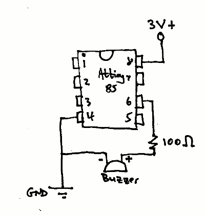

# mins30-85

30 minute timer for ATTing85, programable from the Pi.

Circuit diagram:

## References

* [Arduino White Noise Maker](http://patcox.net/2013/07/24/arduino-white-noise-maker/): includes link to sleepduino.