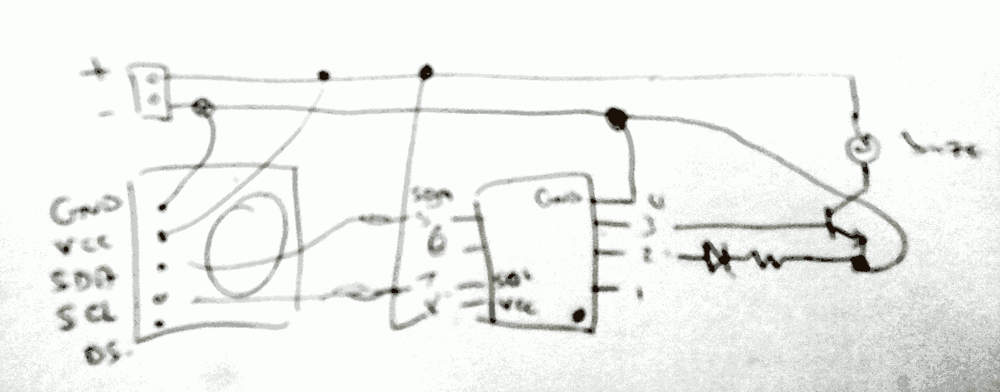

# Pills

A reminder to take your pills.

There are two versions of the code:
* pills-1 uses about 2.4mA whilsts idle, giving the battery life of 43 days, assuming the use of 2500mA rechargeable batteries. Reality seems to suggest that the battery life is far shorter
* pills-2 uses about half the energy of pills-1. It requires the [narcoleptic](https://github.com/brabl2/narcoleptic) library.

## Components

* Tiny RTC I2C Module. It is a clock module. These have a coin cell attached so that it can keep track of the time
* LED
* 33R resistor
* PN2222A NON transistor
* Piezo buzzer
* ATTiny85 chip

## Schematics

Physical layout:

## Implementation details

There is a class called `At`, which switches to `ACTIVATED` when its given hour is reached. You instantiate as many instances of this class as you require. In the code, I have set 4 alarms, to be activated at 8am, 12pm, 5pm, and 9pm.
