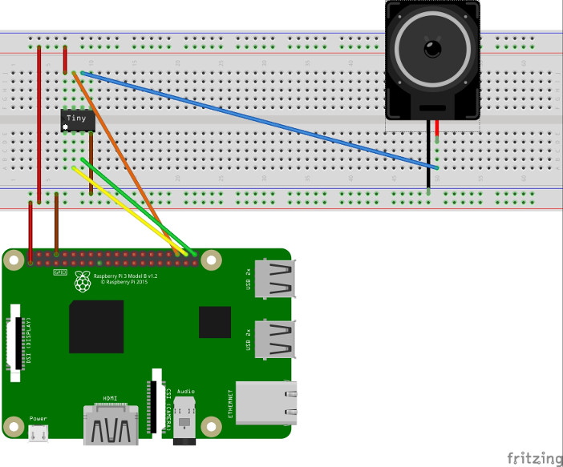

# synth

## Introduction

**What is it?** A simplistic "synthesizer" that you can plug into your Arduino or Raspberry Pi. Use it when you want your project to produce a range of tones, and just want to use a tiny speaker instead of something more elaborate.

It should also work with many other microcontrollers or single-board computers with GPIO pins.

**What's the point?** My knowledge of electronics is bad, so I couldn't really figure out how to get good amplification on a speaker. Producing a consistent sound also proved to be difficult. Raspbian is not a RTOS (Real Time Operating System), which leads to glitchiness if you try to twiddle the pins directly. Execution of programs can be interrupted at any time, which messes with the timing. I toyed with using the [Ultibo](https://ultibo.org) unikernel, which worked better, but it still had the occasional problems with thread scheduling. One possible solution would be to dedicate a core to the task, but I could not get that working.

## schematics



```
           A85  (P85) BCM   (BRD) ARD  DUP
-----------------------------------------------
SPEAKER    PB1    (6)
SND_SS     PB2    (7)  16    (36)   8  Orange
SND_CLK    PB3    (2)  20    (38)   9  Yellow
SND_BYTE   PB4    (3)  21    (40)  10  Green

COLUMNS
A85 refers to pin NAMES on the ATTiny85
P85 refers to the physical pins on the ATTiny85
BCM are the GPIO pin numbers of a Pi3 (Raspberry Pi 3). E.g. "16" means GPIO16
BRD refers to the physical pin numbers on the Pi3
ARD refers to the physical pin numbers on an Arduino Uno R3
DUP refers to suggested lead colurings, which correspond to the the diagram above
```

Note that the speaker refers to a small passive speaker. The remaining lead needs to be
connected to GND on the controlling board. A piezo-electric speaker should also work, but
I dislike the quality of the sound produced.

You will also need to power and ground the ATTiny85, as indicated in the diagram.

